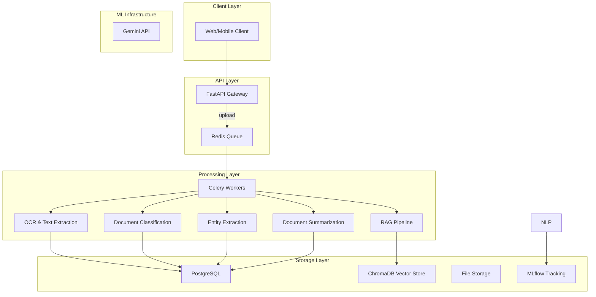

# FinDocAI - Financial Document Processing System

<div align="center">

[](https://python.org)
[](https://fastapi.tiangolo.com/)
[](https://opensource.org/licenses/MIT)
[](https://www.docker.com/)

**An intelligent document processing system that extracts, analyzes, and answers questions about financial documents using modern LLM and RAG architectures**

</div>

## 🚀 Overview

FinDocAI is a production-ready demonstration of AI engineering practices focused on financial document processing. The system leverages state-of-the-art machine learning models and RAG (Retrieval-Augmented Generation) to automate the extraction, analysis, and querying of financial documents including invoices, contracts, bank statements, and loan applications.

### Key Capabilities
- **Document Ingestion**: Multi-format support (PDF, images, text)
- **OCR & Text Extraction**: Hybrid approach with PyPDF2 and Tesseract OCR
- **Document Classification**: Transformer-based with attention-based explanations
- **RAG Pipeline**: Context-aware question answering with ChromaDB
- **Entity Extraction**: Structured data extraction using Gemini API
- **Document Summarization**: AI-powered summary generation
- **Production Monitoring**: Prometheus metrics and structured logging

## 🏗️ Architecture



## 🛠 Tech Stack

| Component | Technology | Purpose |
|-----------|------------|---------|
| Web Framework | **FastAPI** | REST API with async support and automatic documentation |
| Task Queue | **Celery + Redis** | Asynchronous document processing |
| Database | **PostgreSQL** | Structured metadata storage |
| Vector DB | **ChromaDB** | Embeddings and similarity search |
| ML Models | **PyTorch + Transformers** | NLP and document classification |
| OCR | **Tesseract + pdf2image** | Text extraction from documents |
| LLM | **Google Gemini API** | Generation and entity extraction |
| Monitoring | **Prometheus + Grafana** | System metrics and observability |
| Containerization | **Docker** | Deployment and orchestration |

## 📋 Features

### Core Processing Pipeline
- **Upload**: Multi-format document ingestion with security validation
- **OCR**: Text extraction using hybrid approach (native PDF + OCR)
- **Classification**: Document type identification with explainable AI
- **RAG**: Vector-based retrieval for accurate question answering
- **Extraction**: Structured entity extraction for key-value pairs
- **Summarization**: Document content summarization using LLMs

### Security & Authentication
- JWT-based authentication and authorization
- Secure file upload handling with sanitization
- User-specific document access controls
- Encrypted API key management

### Observability
- Prometheus metrics collection
- Structured JSON logging with contextual information
- Processing pipeline monitoring
- Performance and error tracking

## 🚀 Getting Started

### Prerequisites
- **Docker** and **Docker Compose** (v2.0+)
- **Python** 3.10+ (for local development)
- **Google Gemini API key** (optional but recommended)

### Quick Start with Docker (Recommended)

```bash
# Clone the repository
git clone https://github.com/yourusername/findocai.git
cd findocai

# Set up environment variables
cp .env .env.example
# Edit .env to add your GEMINI_API_KEY
nano .env

# Start all services
docker-compose up -d

# Verify system is running
curl http://localhost:8000/health
```

### Local Development Setup

```bash
# Install dependencies
pip install -r requirements.txt

# Set environment variables
export GEMINI_API_KEY="your-gemini-api-key"
export DB_HOST=localhost
export DB_PORT=5434

# Initialize the database
python scripts/init_db.py

# Start the API server
uvicorn app.main:app --reload --host 0.0.0.0 --port 8000

# In a separate terminal, start the Celery worker
celery -A app.worker worker --loglevel=info
```

### API Usage Examples

#### 1. Register and Authenticate
```bash
# Register a new user
curl -X POST "http://localhost:8000/auth/register" \
  -H "Content-Type: application/json" \
  -d '{
    "username": "demo_user",
    "email": "demo@example.com",
    "password": "secure_password123"
  }'

# Login to get JWT token
curl -X POST "http://localhost:8000/auth/login" \
  -H "Content-Type: application/json" \
  -d '{
    "username": "demo_user",
    "password": "secure_password123"
  }'
```

#### 2. Upload a Document
```bash
# Upload with JWT token from login
curl -X POST "http://localhost:8000/upload" \
  -H "Authorization: Bearer YOUR_JWT_TOKEN" \
  -H "Content-Type: multipart/form-data" \
  -F "file=@/path/to/financial_document.pdf"
```

#### 3. Check Processing Status
```bash
curl -X GET "http://localhost:8000/status/DOC_ID_FROM_UPLOAD" \
  -H "Authorization: Bearer YOUR_JWT_TOKEN"
```

#### 4. Query the Document
```bash
curl -X POST "http://localhost:8000/query" \
  -H "Content-Type: application/json" \
  -H "Authorization: Bearer YOUR_JWT_TOKEN" \
  -d '{
    "doc_id": "DOC_ID_FROM_UPLOAD",
    "question": "What is the total amount?"
  }'
```

#### 5. Get Document Summary
```bash
curl -X GET "http://localhost:8000/summary/DOC_ID_FROM_UPLOAD" \
  -H "Authorization: Bearer YOUR_JWT_TOKEN"
```

## 📈 API Endpoints

| Method | Endpoint | Description |
|--------|----------|-------------|
| `POST` | `/auth/register` | Register new user account |
| `POST` | `/auth/login` | Authenticate user and get token |
| `POST` | `/upload` | Upload document for processing |
| `GET` | `/status/{doc_id}` | Check document processing status |
| `POST` | `/query` | Ask questions about a document |
| `GET` | `/summary/{doc_id}` | Get document summary |
| `DELETE` | `/documents/{doc_id}` | Delete document and data |
| `GET` | `/health` | Health check endpoint |
| `GET` | `/metrics` | Prometheus metrics endpoint |

## 🧪 Testing

Run the complete test suite:

```bash
# Run all tests
pytest tests/ -v

# Run tests with coverage
pytest tests/ --cov=app --cov-report=html

# Run specific test files
pytest tests/test_api_integration.py -v
```

## 🔧 Configuration

### Environment Variables

| Variable | Default | Description |
|----------|---------|-------------|
| `GEMINI_API_KEY` | - | Google Gemini API key for LLM features |
| `DB_HOST` | localhost | PostgreSQL host |
| `DB_PORT` | 5434 | PostgreSQL port |
| `DB_NAME` | findocai | PostgreSQL database name |
| `DB_USER` | findocai_user | PostgreSQL username |
| `DB_PASSWORD` | findocai_password | PostgreSQL password |
| `REDIS_HOST` | localhost | Redis host |
| `REDIS_PORT` | 6380 | Redis port |
| `JWT_SECRET_KEY` | a_very_secret_key_for_development | JWT signing key |
| `REQUIRE_AUTH` | true | Enable/disable authentication |

### Docker Compose Services

- `findocai-api`: Main API service (port 8000)
- `findocai-worker`: Celery worker for processing (background)
- `postgres`: PostgreSQL database (port 5434)
- `redis`: Task queue and caching (port 6380)
- `mlflow`: ML experiment tracking (port 5000)

## 📊 Monitoring & Observability

### Metrics
- Document processing metrics (total, duration, current processing)
- API performance metrics (response times, error rates)
- System resource utilization
- Queue performance metrics

Access metrics at: `http://localhost:8000/metrics`

### Logging
- Structured JSON logs with contextual information
- Trace IDs for request correlation
- Error tracking and dead letter queue monitoring

## 🚀 Production Deployment

For production deployments:

1. **Infrastructure**: Use managed services (AWS RDS, ElastiCache, etc.)
2. **Security**: Enable SSL, use secrets management, implement rate limiting
3. **Monitoring**: Set up alerting for key metrics
4. **Backup**: Implement regular database and model backups
5. **Scaling**: Configure auto-scaling for API and worker services

### Production-Ready Features
- Dead letter queue for failed tasks
- Comprehensive error handling
- Resource limits and health checks
- Connection pooling and optimization

## 🤝 Contributing

We welcome contributions! Here's how to get started:

1. Fork the repository
2. Create a feature branch (`git checkout -b feature/amazing-feature`)
3. Make your changes
4. Add tests for new functionality
5. Ensure all tests pass (`pytest tests/`)
6. Submit a pull request

### Development Guidelines
- Follow PEP 8 Python style guidelines
- Write comprehensive tests for all functionality
- Document new features in the `/docs` directory
- Maintain type hints throughout the codebase
- Use structured logging with contextual information

## 📄 License

This project is licensed under the MIT License - see the [LICENSE](LICENSE) file for details.

## 📞 Support

- **Documentation**: Check the [docs](./docs/) directory for comprehensive guides
- **Issues**: Report bugs and feature requests on [GitHub Issues](https://github.com/yourusername/findocai/issues)
- **Contact**: Reach out via [email](mailto:your-email@example.com) for business inquiries

## 🙏 Acknowledgments

- [Hugging Face Transformers](https://huggingface.co/transformers) for pre-trained models
- [FastAPI](https://fastapi.tiangolo.com/) for the excellent web framework
- [ChromaDB](https://www.trychroma.com/) for the vector database solution
- [Google Gemini](https://gemini.google.com/) for the LLM capabilities

---

<div align="center">

**FinDocAI** - Transforming Financial Document Processing with AI

[](https://github.com/yourusername/findocai)
[](https://linkedin.com/in/your-profile)

</div>