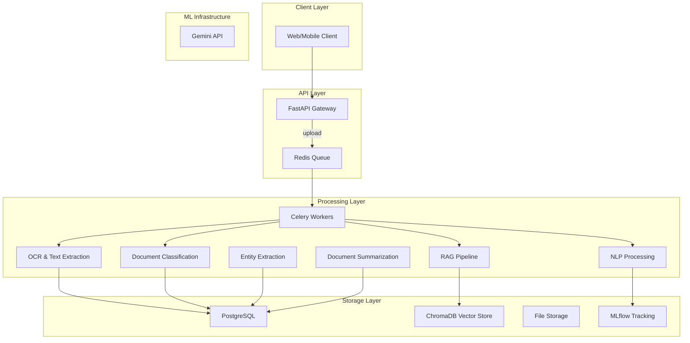

# Architecture

## System Overview

FinDocAI is an intelligent document processing system that extracts, analyzes, and answers questions about financial documents using modern LLM (Large Language Model) and RAG (Retrieval-Augmented Generation) architectures. The system is designed as a production-ready demonstration of AI engineering practices, focusing on financial document processing such as invoices, contracts, bank statements, and loan applications.

## High-Level Architecture

The system follows a microservices-like architecture with these main components:

### API Layer
- **FastAPI** for the web gateway
- Async endpoints for document upload, querying, and status tracking
- Health checks and metrics exposure
- Input validation with Pydantic schemas
- Authentication and authorization via JWT tokens

### Processing Layer
- **Message queue** using Redis and Celery for task management
- OCR and text extraction pipeline (hybrid: PyPDF2/native PDF + Tesseract OCR)
- Document classification using transformer models (DistilBERT)
- Entity extraction and summarization using LLMs (Gemini API)
- Vector storage and retrieval for RAG functionality (ChromaDB)
- Chained and parallel task execution for efficient processing
- Attention-based explanations for classification (XAI features)
- Confidence scoring and source attribution for RAG

### Storage Layer
- **PostgreSQL** for metadata storage
- **ChromaDB** for vector embeddings storage
- Local filesystem for raw document storage
- JSON serialization for complex data structures
- **MLflow** for model experiment tracking

## Component Architecture

## Data Flow

The document processing follows this chained workflow:

1. **Document Upload**: Client uploads a document via the API
2. **Task Queuing**: Document processing task is queued in Redis
3. **Text Extraction**: Extract text from document using OCR/hybrid approach
4. **Classification**: Classify document type using transformer models with XAI explanations
5. **Parallel Processing**: Simultaneously:
   - Index document in ChromaDB (RAG) with confidence scoring
   - Extract entities using LLM
   - Generate document summary
6. **Storage**: All results stored in appropriate storage systems
7. **Completion**: Document marked as processed and ready for queries

## Technology Stack

| Layer | Technology | Purpose |
|-------|------------|---------|
| Web Framework | FastAPI | REST API with async support |
| Task Queue | Celery + Redis | Asynchronous task processing |
| Database | PostgreSQL | Structured metadata storage |
| Vector DB | ChromaDB | Embeddings and similarity search |
| ML Models | PyTorch, Transformers | NLP and classification |
| OCR | Tesseract, pdf2image | Text extraction from documents |
| LLM | Google Gemini API | Generation and extraction |
| Monitoring | Prometheus, Grafana | Metrics and observability |
| Containerization | Docker, docker-compose | Deployment and orchestration |
| Logging | Structlog | Structured logging |

## Security Considerations

- JWT-based authentication and authorization
- Secure file upload handling with sanitization
- Environment variable-based secret management
- Role-based access control for documents
- API key management for LLM services

## Scalability Features

- Asynchronous processing with Celery workers
- Horizontal scaling of API and worker services
- Distributed task queue with Redis
- Containerized deployment for cloud readiness
- Database connection pooling